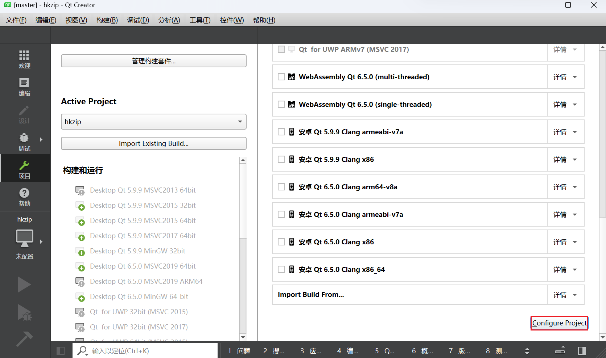

# hkzip
**哈夫曼编码** (**Huffman coding**) 思想实现文件的 **解压缩** 功能，使用 **C++** 开发，带 **qt** 图形界面

**hkzip** is a **file compression** and **decompression** tool implemented in **C++** and **qt**, based on the **Huffman coding** algorithm. It supports dragging and dropping files for compression and decompression operations, and can easily compress files of various formats.


# 简介

**hkzip **是一个用 **C++** 和 **qt** 框架实现的一个解压缩小工具，原理为 **哈夫曼编码** (**Huffman coding**)  思想，支持拖入文件进行压缩和解压缩操作，可以方便地压缩各种格式文件

**hkzip具有以下功能和特性：**

- 支持压缩各种格式的文件，但不支持文件夹的压缩
- 使用了 **qt多线程** 技术，防止压缩和解压操作阻塞主进程，使得进度条可以正常显示
- 支持拖放操作识别文件进行压缩
- 压缩后的文件后缀为hkzip，可指定压缩或解压后文件的路径
- 压缩的文件大小最多支持2.1GB，但由于算法特点，压缩率并不高
- 具有多种报错机制防止程序崩溃
  (压缩对象不可为快捷方式，不然可能出现未知错误！！)

**文件类结构：**


# 配置和使用说明

首先安装qt creator和相关的环境（详情见网络教程）

之后用qt creator打开hkzip.pro文件，之后的步骤见下两张图，最后点击左下角的绿色小三角即可运行程序




**ps.**这里笔者使用的编译器为qt 5.9.9 MinGW 32bit ，高版本应该也向下兼容，但没有测试过

**atten.**项目的路径不可包含中文！！


# 程序运行展示

程序初始画面：


程序运行画面：


程序压缩完成：


程序运行完成：


报错机制展示：


# 部分代码解释

> 核心算法详解：

```C++
//代码见 hkzip.h 中函数的定义(实现)
void process_file();         // 解压缩
void process_file_makezip(); // 压缩
```

**压缩过程：**

打开输入文件，统计每个字符出现的次数，存入一个数组

根据数组中的非零元素，创建一个字符节点列表，每个节点包含字符、权重、左右子节点和二进制编码

把字符节点列表放入一个优先队列，按照权重从小到大排序

从优先队列中取出两个最小权重的节点，创建一个新的内部节点，其权重为两个子节点的权重之和，左右子节点分别为取出的两个节点

把新的内部节点放回优先队列，重复上述步骤，直到优先队列中只剩一个节点，该节点为哈夫曼树的根节点

从根节点开始遍历哈夫曼树，给每个叶子节点（字符）赋予一个二进制编码，左边为0，右边为1

把每个字符的二进制编码存入一个数组，方便后续查找

打开输出文件，写入输入文件的后缀名和一个空字符作为分隔符

写入字符出现次数的数组，作为压缩文件的头部信息

再次打开输入文件，读取每个字符，根据编码数组把它们转换成二进制编码，并写入输出文件

对于最后一段不足8位的二进制编码，特殊处理，补0到8位，并记录实际位数

关闭输入输出文件

**解压缩过程：**

打开输入文件（压缩文件），跳过后缀名和空字符

读取字符出现次数的数组，恢复原始数据的统计信息

根据数组中的非零元素，创建一个字符节点列表，并放入一个优先队列

同样地，从优先队列中构建哈夫曼树，并给每个叶子节点赋予二进制编码

打开输出文件（解压缩文件），从根节点开始遍历哈夫曼树，根据输入文件中的二进制编码判断走向左子树还是右子树

当遇到叶子节点时，把对应的字符写入输出文件，并回到根节点继续遍历

对于最后一段不足8位的二进制编码，特殊处理，只读取实际位数，并解压缩成字符

关闭输入输出文件


# 后记

感谢合肥工业大学张晶老师平时高质量的教学和布置的有意义的课设作业，让我有机会接触到很多新领域的知识。同时，也感谢网络上那些无私分享经验和技巧的博客作者，他们的文章给了我很多启发和帮助。

这是我大一第一次尝试做这种较为复杂的项目，经过暑假的整理和完善，我决定将它开源，希望能对其他有兴趣的同学有所参考和启发。

由于缺乏经验，项目的结构和设计可能还有很多不合理和不完善的地方，欢迎大家提出宝贵的意见和建议，让我能够不断进步和改进。

如果你对我的项目有任何问题或想法，欢迎通过邮件与我联系，我的邮箱是xhk1217@163.com。


